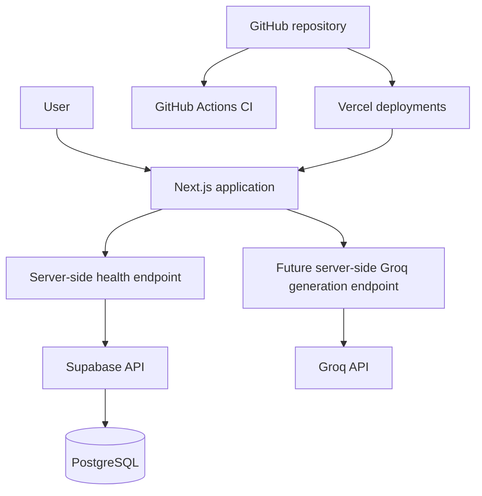

# Architecture

## Trust boundaries

- The browser receives only public Supabase configuration.
- The Groq API key remains server-side and is never prefixed with `NEXT_PUBLIC_`.
- The health endpoint returns sanitized statuses, never secret values.
- Supabase currently exposes only a non-sensitive `health_check()` RPC.
- Authentication and user-owned application data are deferred to a later milestone.
